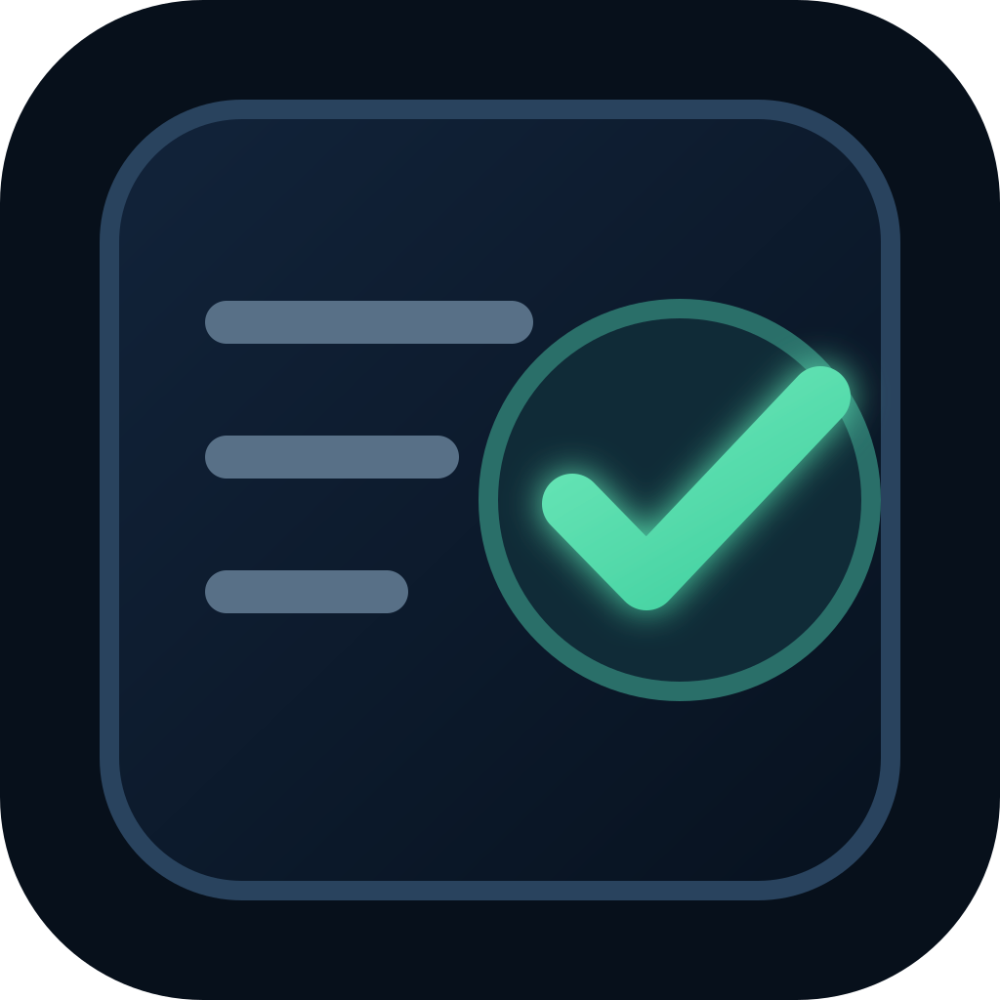

# Delivery Check

<p align="right">
  
</p>

Validate a JSON response, CSV export or text handoff before it reaches the next step. Get a PASS/FAIL result, a list of failed checks and a readable report showing what to fix.

Use it to check required files, exact CSV columns and row counts, JSON field types, byte limits and SHA-256 fingerprints. The checks are deterministic: no model calls or external URL requests. PASS means the supplied contents match your rules; it does not establish content truth or customer acceptance.

## Try it on Apify

1. Open [Delivery Check](https://apify.com/grayt/delivery-check). The form includes a synthetic JSON, CSV and text example.
2. Under **File contents**, enter each filename and paste its text directly. Match the names to **Required files** and edit the rules you need. The JSON editor remains available for API-style input.
3. Run the check. Read **Validation summary** for the result and **What to fix** for failures. **Full report and input diagnostics** contains `OUTPUT` (JSON) and `REPORT.txt` (readable text).

| Result | Meaning | Next step |
| --- | --- | --- |
| PASS | All configured checks passed. | Use the report alongside your own acceptance checks. |
| FAIL | The input was valid, but one or more file checks failed. | Fix the listed files and check again. |
| INVALID_SPEC | The rules or input structure need correction. | Open the diagnostics output. No validation dataset row is created. |

The Store lists `$0.01` per completed PASS/FAIL report (up to 32 files), plus `$0.00005` per Actor start, with platform usage included. A run that returns INVALID_SPEC incurs the start fee but no report event. Input rejected by Apify before a run starts produces neither a run nor an OUTPUT record. Check [current pricing](https://apify.com/grayt/delivery-check/pricing) before running. Apify stores cloud inputs; use synthetic or non-sensitive material. For private files, use the offline preview below.

For the API, the bundle shape is unchanged:

```json
{
  "requirements": [{
    "name": "result.json", "kind": "json", "maxBytes": 1024,
    "jsonSchema": {"type": "object", "required": ["ok"], "properties": {"ok": {"type": "boolean"}}}
  }],
  "files": [{"name": "result.json", "content": "{\"ok\":true}"}]
}
```

See the synthetic [passing](examples/pass.json) and [failing](examples/fail.json) bundles. A successful Actor run means the checker ran; read the report's status to decide whether the files passed.

### Start with a focused synthetic example

For a narrower, preconfigured first run, use one of the public Task pages below. Both examples contain synthetic data only and expose just the inputs needed for that check.

- [Check CSV headers and row counts before delivery](https://apify.com/grayt/delivery-check/examples/check-csv-headers-and-row-counts-before-delivery) validates an exact CSV header order and bounded data-row count.
- [Validate a JSON API response before handoff](https://apify.com/grayt/delivery-check/examples/validate-a-json-api-response-before-handoff) validates required JSON fields and types against a bounded schema.

Each Task uses a 60-second timeout, 256 MiB memory, and a maximum per-run charge of `$0.02`. Do not submit sensitive files: Apify stores cloud inputs. Use the offline preview below for private material.

## Offline browser preview

[Download the browser preview](https://github.com/QIU-Guanzong/delivery-check/releases/download/browser-preview-0.1.0/delivery-check.html) · [Release notes](https://github.com/QIU-Guanzong/delivery-check/releases/tag/browser-preview-0.1.0)

Or build it locally:

```sh
npm ci
npm run build:web
```

Open `dist/delivery-check.html` in a modern browser. No server, account or internet connection is required. Select one CSV, JSON or UTF-8 text file (up to 1 MiB), or paste contents. Set expected CSV columns/row counts or an optional JSON Schema, then check and download the JSON report. The free local preview uses the same checker as the CLI; the CLI/API continue to support bundles of up to 32 files.

This preview does not detect duplicate SKUs, check CSV business-field values, map Shopify columns or guarantee a platform import. Those are separate potential product extensions. No checkout, subscription, advertising, usage tracking or customer revenue is implemented in the preview.

All assets and license notices are embedded in the HTML. The page has no network requests or application storage; its Content Security Policy blocks connections. AJV needs local dynamic code compilation for the bounded schema subset. Loaded file bytes preserve BOM and CRLF for hashing; editing the textarea changes the working content and its fingerprint. Invalid UTF-8 and oversized files are rejected. Clear removes the active file, rules and report.

See [browser validation](web/VALIDATION.md). The published Apify cloud build and RapidAPI deployment status are separate from this local browser release.

## Run locally

Requires Node.js 22 or 24 and npm.

```sh
npm ci --ignore-scripts
npm test
npm run check -- examples/pass.json
npm run check -- examples/fail.json
```

The CLI exits with `0` for PASS, `1` for a failed delivery, and `2` for an invalid specification/input. Use `node src/cli.js input.json` for clean JSON output without npm's banner.

## Input

Provide `requirements` and `files`. File contents are UTF-8 strings inside the input JSON. Names are labels, not filesystem paths or URLs. Every requirement is mandatory. Unlisted files fail unless `allowExtraFiles` is true; allowed extras have no per-file contract checks.

```json
{
  "requirements": [
    {"name": "result.json", "kind": "json", "maxBytes": 10000,
     "jsonSchema": {"type": "object", "properties": {"ok": {"type": "boolean"}}, "required": ["ok"]}},
    {"name": "evidence.md", "kind": "text", "maxBytes": 10000}
  ],
  "files": [
    {"name": "result.json", "content": "{\"ok\":true}"},
    {"name": "evidence.md", "content": "Two synthetic checks passed."}
  ]
}
```

### File checks

| Rule | What is checked |
|---|---|
| `name` | Exact match to a supplied file; duplicates and paths are rejected |
| `kind` | `text`, `json`, or `csv`; this selects a parser, not a filename extension |
| `maxBytes` | Actual UTF-8 byte count, inclusive |
| `sha256` | Optional expected digest of the exact UTF-8 contents |
| `jsonSchema` | Optional bounded draft-07 schema; no coercion, defaults or repairs |
| `csv.headers` | Required for CSV; exact ordered header names |
| `csv.minRows` / `maxRows` | Inclusive data-row count, excluding the header and empty lines |

CSV uses commas and standard quoted fields; CRLF, embedded quoted newlines and an initial BOM are supported. Whitespace is preserved. Inconsistent row widths fail. Text rules check size/encoding/hash only. HTML can be submitted as text, but rendering, scripts and accessibility are not checked.

### Limits

32 required files and 32 supplied files; 1 MiB per file; 4 MiB total decoded contents; 6 MiB serialized input; nesting up to 48 levels. Filenames use ASCII letters, digits, spaces, `_`, `-` and `.`, starting with a letter or digit. No ZIP, binary uploads, remote fetches, local directory traversal or script execution.

JSON schemas are limited to 16,000 characters and 12 schema levels. Common type, required-field, property, item, enum, const, numeric and length constraints are supported. References, regex, formats, combinators (`allOf`/`anyOf`/`oneOf`/`not`), conditional schemas, dependencies and `uniqueItems` are deliberately rejected. Unsupported keywords fail as INVALID_SPEC rather than being silently ignored. JSON duplicate keys follow standard `JSON.parse` behavior (last value wins); duplicate-key detection is not provided. CSV records are limited to 65,536 characters.

## Results

The report separates `PASS`, `FAIL` and `INVALID_SPEC`. Each required file lists checks, byte size and SHA-256. Failed checks include a repair message and bounded diagnostics: byte and row counts, CSV header differences, parser location where available, and JSON schema paths. Parser messages and CSV data rows are not echoed. Names, headers, hashes and field paths can still be sensitive.

See [sample output](examples/pass-report.json) and [failure output](examples/fail-report.json). On Apify, the full report is saved as key-value record `OUTPUT`; PASS and FAIL produce one dataset row with the per-file checks. INVALID_SPEC produces no dataset row; open **Full report and input diagnostics** for `OUTPUT` and `REPORT.txt`. A successful Actor run can contain a FAIL report: the checker ran successfully and found a failed delivery. Check the report's status rather than the Actor process status.

## Privacy and cloud use

The local CLI reads only the input file you explicitly pass; the core never opens paths from the contract. Running on Apify sends and stores the submitted input on Apify infrastructure. Do not submit secrets or material you lack permission to process. The actor itself makes only the SDK storage/status calls needed for its own run and does not send contents to a model or external site. Platform retention/access settings govern cloud records.

## Apify deployment

Import this repository through My Actors → Connect Git. The `.actor` folder includes the Dockerfile, input/output schemas, and a dataset schema with a machine-readable result contract and `overview` view. Start with `examples/pass.json`, then `examples/fail.json`; inspect OUTPUT and the dataset for the expected statuses. Use limited permissions, 256 MiB memory and a 60-second run timeout. No recurring schedule or Standby mode is needed.

The Store input form preloads the same synthetic JSON, CSV, and text PASS bundle used by the local example, so a first-time user can see all three advertised input types in one run.

The dataset view also meets the dataset-schema prerequisite for a public Apify Task landing page. Publishing that page still requires creating and saving a complete task configuration in Apify Console; this repository change does not publish a task or alter the live Actor.

Two tested, synthetic task-page drafts are in [`examples/tasks/`](examples/tasks/): one for CSV header/row-count checks and one for JSON API response schemas. Their focused titles and descriptions are candidates for search/agent discovery. They omit the server-controlled publication fields; publishing is a separate account action and makes the sample inputs public.

The hosted listing uses pay-per-event pricing, active September 11, 2026: $0.01 for one completed PASS or FAIL report (up to 32 files), plus $0.00005 per Actor start at the fixed 256 MiB memory setting. Platform usage is included. A started run returning INVALID_SPEC writes diagnostics to OUTPUT but no dataset row, so only the start fee applies. Input rejected before startup has no run or report. The report charge uses Apify's synthetic default-dataset-item event; no additional custom report event is charged. Check the live Store pricing before running. The local CLI remains MIT licensed and has no service fee.

## Implementation

`src/check.js` is reusable without Apify. `src/cli.js` reads one JSON input. `src/actor.js` adapts the same checker to Apify. A [local ACP handler prototype](acp/README.md) also reuses the checker; it is tested locally but has no deployed ACP offering or verified payment flow.

MIT licensed. Runtime dependencies are pinned in package-lock.json. AJV validates contracts; csv-parse handles quoted CSV; the Apify SDK stores Actor outputs. See [test evidence](TEST_REPORT.md) for the checks actually run.

## HTTP API adapter

An optional HTTP adapter and OpenAPI import are in [rapidapi](rapidapi/README.md). Local integration tests pass; no RapidAPI public backend or monetized listing is deployed. The Apify entry point is unchanged.

## Use from an MCP client

The hosted [Apify MCP server](https://github.com/apify/apify-mcp-server) can expose this Actor directly. Use this server URL with a compatible client and authenticate with your own Apify account through OAuth:

```text
https://mcp.apify.com?tools=grayt/delivery-check
```

Use `fetch-actor-details` with `actor: "grayt/delivery-check"` on the general Apify MCP server to inspect the input contract first. After a run, use the returned dataset ID with `get-dataset-items` and read its `summary` and `failures` fields. If the dataset is empty, retrieve the `OUTPUT` record from the run's default key-value store for invalid-input diagnostics. Cloud storage and runtime usage still apply.

On 2026-09-11, public MCP discovery returned this Actor's input and inferred output schemas. The listing now exposes PAY_PER_EVENT pricing through MCP. Authenticated MCP execution and external paid calls have not been tested; no customer revenue or payout is claimed.
